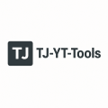

# TJ-YT-Tools

### APP WILL BE PUBLISHED SOON. PUBLICATION DATE IS IN THE NEXT FEW WEEKS

TJ-YT-Tools is a Python-based toolkit designed to help YouTube channel managers streamline their workflow by automating routine tasks. With a focus on securely managing video metadata, this tool offers several powerful features to make channel management more efficient.

## Key Features

- **Bulk Editing:** Quickly update video titles and descriptions across your YouTube channel. Whether you need to rename a series or adjust details on multiple uploads, TJ-YT-Tools makes it fast and effortless.
- **Secure OAuth Integration:** Uses the `https://www.googleapis.com/auth/youtube.force-ssl` scope to ensure a secure connection with the YouTube Data API. This allows for safe retrieval and updates of video data, while protecting your account through industry-standard OAuth flows.
- **Interface:** User-friendly GUI for a more interactive experience.  
- **Python-Powered:** Built entirely in Python, making it easy to integrate, customize, and extend according to your channel’s needs.

## Overview

TJ-YT-Tools automates key aspects of YouTube channel management, reducing the manual effort required to keep your channel up-to-date. Ideal for content creators and channel managers, the tool is designed to enhance productivity by streamlining the process of editing video information in bulk so you can focus more on creating content and less on administrative tasks.

## Privacy Policy – TJ’s YouTube Tools
[Privacy Policy](https://teejay69.github.io/TJ-YT-Tools/Privacy-Policy.html)

https://teejay69.github.io/TJ-YT-Tools/Privacy-Policy.html

This Privacy Policy explains how **TJ’s YouTube Tools** (“Application”, “we”, “us”, or “our”) processes personal data in compliance with the General Data Protection Regulation (GDPR) and applicable German data protection laws. Please read this document carefully.

## 1. Data Controller

The data controller responsible for this Application is:  
**Tim Weber**  
Ayrerstr. 3  
90480 Nürnberg  
Email: [timweberj@gmail.com](mailto:timweberj@gmail.com)

## 2. Purpose and Scope

The Application is developed to help YouTube channel managers automate routine metadata updates and playlist management tasks. It uses the YouTube Data API to interact with YouTube video data.

**Important:** The Application is designed to work with your own YouTube account only. No third-party user data is collected, stored, or shared. Only publicly available data is used to provide the functionality of the Application.

## 3. Data Processing

The Application does not actively collect or store any personal data from users beyond what is publicly available from YouTube for your own account. All data processing activities are limited to enabling the features of the Application for channel management.

## 4. Legal Basis for Processing

The processing of data in connection with the Application is based on the legitimate interests of the data controller in efficiently managing their YouTube channel. As no additional personal data is processed, the risks to data subjects are minimal.

## 5. Data Security

We take the security of your data seriously. All API communications are encrypted, and we implement appropriate technical and organizational measures to prevent unauthorized access.

## 6. Your Rights

Under the GDPR, you have rights regarding access, rectification, or deletion of your personal data. However, since the Application does not collect personal data from third parties, these rights are not applicable here. If you have any questions concerning data protection, please contact us using the information provided above.

## 7. Changes to This Privacy Policy

We may update this Privacy Policy occasionally. Any changes will be posted on this page and will become effective immediately upon posting. Please review this page periodically.

## 8. Contact

For any questions or concerns related to data protection or this Privacy Policy, please contact us at:  
Email: [timweberj@gmail.com](mailto:timweberj@gmail.com)

## Terms of Service

This application is a tool designed for YouTube channel management, enabling efficient updating of video metadata and playlist organization. By using this tool, you agree to use it responsibly and in accordance with YouTube’s policies. No personal data from third parties is collected or shared through this application. The tool is provided "as-is" without any warranties. We shall not be held liable for any damages or losses incurred in connection with the use of this tool. Users are encouraged to employ it solely for lawful purposes. This Terms of Service is governed by the laws of Germany. We may update these terms from time to time, and by continuing to use the application, you agree to the revised terms.
